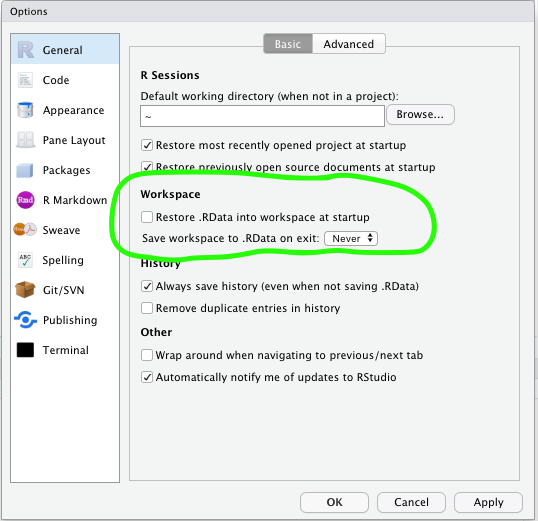

# Module 1 - introduction to R

In it's simplest form R can be used as a calculator with `+`, `-`, `/` or `*`.

```{r plus}
100 + 4
```

Or

```{r m_calc}
4 * 6 - 2
```

-

Create objects with `<-`, which is called *the assign operator*.

```{r save_object}
x <- 100 + 4
x
```

-

The *assign operater* `<-` can be reversed `->`

```{r rev_assign}
100 + 4 -> x
x
```

-

You can combine values, or objects in a new object with the function `c()` (*c* for *combine*).
When objects are combined they are called a *vector*.

```{r vector}
x <- c(4, 100 + 4, 10 * 2)
x
```


Objects and vectors are not restrained to numerical values, you can use text in them as well.

```{r text_vector}
text <- c("hej", "jag", "älskar", "r")
text
```


However, you cannot mix numerical and text values.

```{r mixed}
blandat <- c(1, 5, "hej", 6)
blandat
```


## Missing values

`NA` is not *zero*. It is not a value. 

```{r na}
x <- c(4, NA, 2, 50)
```


If check which values that are larger than two:

```{r na_check}
x > 2 
```


Let's filter out all the `NA`'s:

```{r na_fail}
x == NA
```


Confusing?

```{r na_age}
fredriks_age <- NA
markus_age <- NA
fredriks_age == markus_age
```


If we want to find an `NA` or filter out `NA`s we us `is.na()` instead.

```{r is_na}
is.na(x)
```


`na.rm` is a common argument in functions. 

```{r func_na}
mean(x)
```

We use `na.rm = TRUE`

```{r func_na_success}
mean(x, na.rm = TRUE)
```


## R is a functional programming languange

- Functions reside in packages
- Functional programming is great for Data Science


## Functions

Just like in Excel

- mean()
- median()
- sd()
- ...and so on


And mathematical

- log()
- sin()
- cos()
- ...osv


## Documentation

To access documentation about functions, i.e. how they work, you just add a question mark in front of the function that you are interested in.

```{r docu, eval=FALSE}
?mean()
```


## Excercices

- Use some of R's statistical functions on a numerical vector


## data.frame

data.frames are a common format when doing data science in R. A data.frame is a rectangular table with one or more columns.

```{r df, echo=FALSE}
head(nycflights13::flights)
```


We can create our own data frames in R.

```{r, create_df}
data.frame(random_number = rnorm(5))
```


If you have two vectors of the same lenght you can combine them to a data.frame.

```{r df_mixed2}
siffror <- c(5,1,2,5)
ord <- c("vad", "var", "det", "där")

data.frame(siffror, ord)
```


## Packages

- To install a package from `CRAN` you use the function `install.packages("package")`.

- After downloading a package your need to load it with `library(package)`.


## Excercise

The package `tidyverse` is downloaded for you. Load it with `library()`.


## tidyverse and friends


- tidyverse is a collection of packages for common tasks in data analysis. 


- They share a common philosophy


- Easy to use


- We will focus on tidyverse


### Workflow in R

- Use projects
- Never save your workspace


```{r echo=FALSE}

```


### Writing code in R

- Follow the `tidyverse styleguide`

Name objects, functions and data.frames with *small letters* and *_* between words.

```{r eval=FALSE}
min_egna_funktion <- function(x)
```

In contrast to:

```{r eval=FALSE}
MinEgnaFunktion <- function(x)
```


- You are writing text for someone to read it
- Use space between `,`

GOOD:

```{r eval=FALSE}
mean(x, na.rm = TRUE)
```

BAD:

```{r eval=FALSE}
mean(x,na.rm=TRUE)
```


## When saving files

When saving files we try to follow this principle, so when you name a file name it `min_r_fil.R` instead of `min R fil.R`.


## Avoid long expressions

This is harder to read:

```{r eval=FALSE}
iris %>% group_by(Species) %>% summarise(Sepal.Length = mean(Sepal.Length), Sepal.Width = mean(Sepal.Width), Species = n_distinct(Species))
```


Than this:

```{r eval=FALSE}
iris %>%
  group_by(Species) %>%
  summarise(
    Sepal.Length = mean(Sepal.Length),
    Sepal.Width = mean(Sepal.Width),
    Species = n_distinct(Species)
  ) 
```


### Rmarkdown
- A notebook format in R
- Great for creating reports
- Great for exploratory analysis

- Open up `intro-to-r.Rmd`


# Data manipulation with dplyr

dplyr is a package that makes data manipulation easy. It consists of five main verbs: 


- `filter()`


- `arrange()` 


- `select()` 


- `mutate()`


- `summarise()`


Other useful functions such as `glimpse()`

```{r glimpse, message=FALSE}
library(tidyverse)
library(nycflights13)
glimpse(flights)
```


## Excercise

- Import the customer data into R using `read_csv("path")`, save it to a data.frame
- Use `glimpse()` on it

## `filter()`

`filter()` is a function that let's you filter out rows that meet certain conditions. 


```{r filter1}
filter(flights, month == 2)
```


We can also use text:

```{r filter2}
filter(flights, origin == "JFK")
```

And combine them:

```{r filter3}
filter(flights, origin == "JFK" & month == 2)
```

We can also filter out every row that meets a condition in a vector, for instance:

```{r filter4}
filter(flights, origin %in% c("JFK", "LGA")) 
```

### Operators

In R, as in any programming languange, there are a number of logical and relational operators.

In R these are:
```{r rel_op, echo = FALSE}

  tibble::tibble(`Relation operators` = 
                                c("och (and) ", "eller(or)", "icke(not)"),
                              `Symbol in R` = 
                                c("&", "|", "!"))
```

```{r log_op, echo = FALSE}
  tibble::tibble(`Logical Operators` =
                              c( "equal", "not equal", "larger than or equal", "smaller than or equal",
                           "larger than", "smaller than", "is in"),
             `Symbol in R` = c("==", "!=", ">=", "<=", ">", "<", "%in%"))
```


## We also have operators for checking if something is TRUE

- Instead of writing `x == TRUE` you should write `isTRUE(x)` and `!isTRUE(x)` if you want to check if something is `FALSE`.


### Use filter to find...


1. How many customers had a data-volume over 1000 in february 2019?


2. How many customers have been members longer than 2005


3. How many customers have a data-volume over 2000 in february and have a calculated revenue larger than 500 per month?


4. How many customers have a subscription with "Rörlig pris"?


5. Are there any customers that are missing an ID? I.e. is `NA`.


### stringr 

- When working`filter()` it is common that we want to filter out certains parts of a string
- `stringr` is a great package for manipulating strings in R
- Usually it's functions starts with `str_...`, such as `str_detect()`.

Here are some useful functions:

```{r}
library(stringr)
frukt <- c("apple", "orange", "banana")
str_detect(frukt, "b")
```

Or `str_replace()` 

```{r}
str_replace(frukt, "a", "ä")
```

Or `str_remove()`

```{r}
str_remove(frukt, "a")
```

### stringr in `filter()` 

We can use `stringr` in `filter()`:

```{r}
filter(flights, str_detect(carrier, "U"))
```

## Regex
- Specific string manipulation

For example:

```{r}
frukt
str_detect(frukt, "^b")
```

and

```{r}
frukt
str_detect(frukt, "e$")
```

## Excercise 2

1. How many customers have a subscription with "Fast pris"?
2. How many customers have a subscription that is *not* "Bredband"?

## `arrange()`

`arrange()` is a verb for sorting data.frames.

```{r}
arrange(flights, dep_delay)
```


If you instead want to sort in descending order you can write like this:

```{r}
arrange(flights, desc(dep_delay))
```

#### Excercise 3

1. Which customer has been "active" longest? What is the date?
2. Which customer is most newly active?

## `select()`

`select()` is a verb for selecting columns in a data.frame.

You can choose columns by their name:

```{r}
select(flights, year, month, day, origin)
```

You can also choose columns based on their numerical order

```{r}
select(flights, 1:5)
```

You can select all the columns from column_a to column_d with`:` :

```{r}
select(flights, year:origin)
```

### Help functions

When you do data science you often want to move columns for different reasons. Not seldom you want to put one column first and the rest after. For this you can use the help function `everything()`:

```{r}
select(flights, origin, everything())
```

Apart from `eveything()` there are a number of other help functions:


- starts_with("asd")


- ends_with("air")


- contains("flyg")


- matches("asd")


- num_range("flyg", 1:10) matches flyg1, flyg2 … flyg10

You can use these in the same way as `everything()`.

```{r}
select(flights, origin, starts_with("m"))
```


## rename()

To rename a variable you use `rename(data, new_variable = old_variable)` 

```{r}
rename(flights, år = year)
```

## Excercise 4


1. Choose all columns that contain ”nm"


2. Choose the column for customer ID and all columns that starts with ”tr_tot"


3. Rename ”pc_priceplan_nm" to ”price_plan"

## `mutate()`

- `mutate()` is a verb for manipulating and creating new columns

Below we create a new column with the mean of departure delay.

```{r}
mutate(flights, mean_dep_delay = mean(dep_delay))
```

You can also use with simple mathematical operators `mutate()`:

```{r}
mutate(flights, beer_time = dep_delay - arr_delay)
```

There is a variant of mutate `mutate()` called`transmute()` that will return only the column that you have maniuplated.

```{r}
transmute(flights, beer_time = dep_delay - arr_delay)
```

In combination with `mutate()` you can use a variety of functions, some example of useful functions inside mutate is:

- rank(), min_rank(), dense_rank(), percent_rank() to rank 


- log(), log10() to take the log of a variable


- cumsum(), cummean() for cummulative stats


- row_number() if you need to create rownumbers


- lead() and lag()

For example we can lag departure delay and save it in a new variable.

```{r}
transmute(flights, lag_dep_delay = lag(dep_delay))
```


### if_else()

- A common task in Excel or any other programming languange is to compose `if else`-statements. 
- The best way to do this in R is with the function `if_else()`

```{r}
transmute(flights, försenad = if_else(dep_delay  > 5, true = "försenad", false = "ej försenad"))
```


If you want to make multiple `if else`-statements, instead of making multiple `if else`-statements you can use the `case_when()` function:

```{r}
transmute(flights, försenad_kat = case_when(
  dep_delay + arr_delay > 80 ~ "mycket_försenad",
  dep_delay + arr_delay > 0 ~ "ganska_försenad",
  dep_delay + arr_delay  <= 0 ~ "ej_försenad",
  TRUE ~ "okänd"))
```

## Excercise 5


1. Create a new variable that is the mean of the last 3 months of data consumption


2. Create a variable that takes the logarithm of your previously created column


3. Create a new variable that indicates if the priceplan is "Bredband" or not.


4. Create a new variable that groups priceplan in "Fast pris", "Rörligt pris", "Bredband" and "Annan" for everything that is not in any of the previous.


## Dates

- Dates a information about time that we commonly use in analytics. 
- The easiest way to manipulate dates in R is with the package `lubridate`.

In order to get todays date you can use the function `Sys.Date()`(that is built into R).

```{r}
Sys.Date()
```

Say that you want to find the month, week or year of a date. 

The package `lubridate` contains useful functions for this, such as `year()`, `month()` and `week`.

```{r}
library(lubridate)

week(Sys.Date())
```

In general you should define your date before passing it to a lubridate-function. In other words, you can't just use a string (even though that sometimes work).

```{r error=TRUE}
days_in_month("2019-03-15")
```

You can define you with with `as.Date()`, where you also can specify the format of the date.

```{r}
as.Date("2018-03-15", format = "%Y-%m-%d")
```

This is especially useful if your date is written in a non-standard way.

```{r}
as.Date("03/18/15", format = "%m/%y/%d")
```

Other functions that are useful in lubridate are `days_in_month`:

```{r}
days_in_month(as.Date("2018-03-15"))
```

And `floor_date()` if you, for example, want to find the first date in a month or a week,.

```{r}
floor_date(as.Date("2018-03-15"), unit = "month")
```

## Excercise 6

1. Create a varible for month `lubridate::month(x)` of customer activation
2. Create a new varibale for `year` of customer activation
3. Create a new variable with the number of days in the month of activation

## `summarise()`

`summarise()` is a verb for summarizing data (you can also spell i `summarize()`).

```{r}
summarise(flights,
          mean_dist = mean(distance, na.rm = T), 
          median_dist = median(distance, na.rm = T),
          sum_dist = sum(distance, na.rm = T)
)
```

### group_by()

Below we create a new grouped data set grouped on `carrier` och `dest`.

```{r}
carrier_dest_flights <- group_by(flights, carrier, dest)
```

Every summarisation or mutation done on this new data-set will be done group wise. 

```{r}
summarise(carrier_dest_flights, mean_dep_delay = mean(dep_delay, na.rm = T))
```

## Excercise 7

1. What is the sum data volume during the last month? What's the mean and median and what are the max and min values? You can use `max()` and `min()` to calculate maximum and minimum-values. 


### More expressions

You can combine `dplyr`-verbs

```{r}
summarise(group_by(flights, carrier),
          mean_dep_delay = mean(dep_delay, na.rm = T))
```

However, the more verbs you combine the harder it will be to read:

```{r}
summarise(
  group_by(
    filter(flights, dep_delay < 60),
    carrier),
  mean_dep_delay = mean(dep_delay, na.rm = T), n_flights = n())
```

#### %>% "the pipe"

- `%>%` from the `magrittr`-package. `%>%`  is called "the pipe" and is pronounced "and then". 

```{r}
flights %>%
  filter(dep_delay < 60) %>%
  group_by(carrier) %>%
  summarise(
    mean_dep_delay = mean(dep_delay, na.rm = T),
    n_flights = n()
  )
```


## Excercise 8

Use `%>%` and answer the following questions:


1. Which CPE type is most common?


2. Which priceplan has the highest mean data volume (for febraury 2019)?


3. Calculate the mean of data volume for the year that the customer was created. Which year has the highest mean?


## Joins

To join data frames is an essential part of data manipulation, to do that we use `dplyr`'s different join functions:

- `left_join()`
- `right_join()`
- `full_join()`
- `inner_join()`
- `semi_join()`
- `anti_join()`


## Joins som venn

```{r echo=FALSE}
knitr::include_graphics("images/join-venn.png")
```

```{r}
flights %>% 
  select(year:day, hour, origin, dest, tailnum, carrier) %>% 
  left_join(airlines, by = c("carrier" = "carrier"))
```


## Excercise 9

- Left join your data with `tele2-kunder-transaktioner.csv` on `custid`.


## Tidy data

- `tidy` data is when every observation is a row and every variable is a column. 

```{r}
library(gapminder)
gapminder
```


## Untidy data

```{r}
library(readxl)
gapminder_untidy <- read_excel("data/life_expectancy_at_birth.xlsx")
gapminder_untidy 
```

We want to gather the columns

```{r eval=FALSE}
data %>% 
  gather(key, value, columns_to_gather)
```

```{r}
gapminder_untidy %>% 
  gather(key = year, value = life_expectancy, -`Life expectancy`) %>%
  rename(land = `Life expectancy`) %>% 
  mutate(life_expectancy = as.numeric(life_expectancy))
```

- `spread()` does the opposite.

## Excercise 10

- In your data set you have 12 columns for data volume consumption per month, `tr_tot_data_vol_all_netw_1:tr_tot_data_vol_all_netw_12`

- Every column represent a month and you want to calculate the mean of data volume consumption over time.

- The columns represent a month

- The first column `tr_tot_data_vol_all_netw_1` is the latest month, i.e. "2019-04-30"

- Create a vector with all the month dates corresponding to the columns.

- R function called `seq()` 

```{r}
new_cols <- seq(from = as.Date("2018-05-30"), by = "month", length.out = 12) %>% 
  as.character()

new_cols
```

Rename every column by it's date.

```{r eval=FALSE}
kunder %>% 
  select(cust_id, source_date, pc_priceplan_nm, tr_tot_data_vol_all_netw_1:tr_tot_data_vol_all_netw_12) %>% 
  rename_at(vars(tr_tot_data_vol_all_netw_1:tr_tot_data_vol_all_netw_12), ~new_cols)
```

- Fill in the `sort(decreasing = )` to `TRUE`
- Gather the data into two new columns called `data_month` and `data_volume`
- Turn `data_month` into a date-column

```{r eval=FALSE}
new_cols <- seq(from = as.Date("2018-05-30"), by = "month", length.out = 12) %>% 
  sort(decreasing = ) %>% 
  as.character() 

kunder_tidy_month <- kunder %>% 
  select(cust_id, source_date, pc_priceplan_nm, tr_tot_data_vol_all_netw_1:tr_tot_data_vol_all_netw_12) %>% 
  rename_at(vars(tr_tot_data_vol_all_netw_1:tr_tot_data_vol_all_netw_12), ~new_cols) %>% 
  gather(... , ... , `2018-05-30`:`2019-04-30`) %>% 
  mutate(data_month = as.Date(data_month))
```

- Calculate the mean value per priceplan and month

```{r eval=FALSE}
mean_volume_sum <- kunder_tidy_month %>% 
  group_by(pc_priceplan_nm, data_month) %>% 
  summarise(mean_volume = mean(data_volume, na.rm = T))

mean_volume_sum 
```

Execute the code to visualize:

```{r eval=FALSE}
p <- ggplot(mean_volume_sum, 
         aes(x = data_month, y = mean_volume, color = pc_priceplan_nm)) +
  geom_line() +
  scale_color_discrete() +
  theme(legend.position = "none")
```

```{r eval=FALSE, out.width="100%"}
widget <- plotly::ggplotly(p)
htmlwidgets::saveWidget(widget, "plotly_ex.html")
```

<iframe src="plotly_ex.html" width = "900px", height = "600px" frameBorder="0"></iframe> 

# Answers to excercises 


## Excercise

- Press the `knit` button to compile this Rmarkdown-notebook to a HTML-document
- Change the `author` to your name, knit the document again

## Excercise

The package `tidyverse` is downloaded for you. Load it with `library()`.

```{r}
library(tidyverse)
```

## Excercise
- Import the customer data `tele2-kunder-sample.csv` into R 

```{r}
kunder <- read_csv("data/tele2-kunder-sample.csv")
```

- Use `glimpse()` on it

```{r}
glimpse(kunder)
```


- Try knitting the Rmarkdown again

## Excercise 1

1. How many customers had a data-volume over 1000 in february 2019?

```{r}
filter(kunder, tr_tot_data_vol_all_netw_3 > 1000)
```

2. How many customers have been "active" longer than 2005?

```{r}
filter(kunder, rt_fst_cstatus_act_dt < "2005-01-01")
```

3. How many customers have a data-volume over 2000 in february and have a calculated revenue larger than 500 per month?

```{r}
filter(kunder, tr_tot_data_vol_all_netw_3 > 2000 & alloc_rrpu_amt > 500)
```

4. How many customers have a priceplan with "Rörlig pris"?

```{r}
filter(kunder, pc_priceplan_nm == "Rörligt")
```

5. Are there any customers that are missing an ID? I.e. is `NA`.

```{r}
filter(kunder, is.na(cust_id))
```

- Knit the document again

## Excercise 2

1. How many customers have a subscription with "Fast pris"?

```{r}
filter(kunder, str_detect(pc_priceplan_nm, "Fast pris"))
```

2. How many customers have a subscription that is *not* "Bredband"?

```{r}
filter(kunder, !str_detect(pc_priceplan_nm, "Bredband"))
```

- ...dare I say... knit the document again?

## Excercise 3

1. Which customer has been "active" longest? What is the date?

```{r}
arrange(kunder, rt_fst_cstatus_act_dt)
```

2. Which customer is most newly active?

```{r}
arrange(kunder, desc(rt_fst_cstatus_act_dt))
```

## Excercise 4

1. Choose all columns that contain ”nm"

```{r}
select(kunder, contains("nm"))
```

2. Choose the column for customer ID and all columns that starts with ”tr_tot"

```{r}
select(kunder, cust_id, starts_with("tr_tot"))
```

3. Rename ”pc_priceplan_nm" to ”price_plan"

```{r}
rename(kunder, price_plan = pc_priceplan_nm)
```

## Excercise 5

1. Create a new variable that is the mean of the last 3 months of data consumption for all customers, save this to the data set

```{r}
kunder <- mutate(kunder, mean_3_months = mean(tr_tot_data_vol_all_netw_1 + tr_tot_data_vol_all_netw_2 + tr_tot_data_vol_all_netw_3, na.rm = T))
```

2. Create a variable that takes the logarithm with base 10 (`log10`) of your previously created column

```{r}
mutate(kunder, log10_mean_3_months = log10(mean_3_months))
```

3. Create a new variable that indicates if the priceplan is "Bredband" or not, save it to the data set

```{r}
kunder <- mutate(kunder, bredband = if_else(str_detect(pc_priceplan_nm, "Bredband"), "bredband", "ej bredband"))
```

4. Create a new variable that groups priceplan in "Fast pris", "Rörligt pris", "Bredband" and "Annan" for everything that is not in any of the previous.

```{r}
kunder <- mutate(kunder, priceplan_cat = case_when(
	str_detect(tolower(pc_priceplan_nm), "fast pris") ~ "Fast pris",
	str_detect(tolower(pc_priceplan_nm), "bredband") ~ "Bredband",
	str_detect(tolower(pc_priceplan_nm), "rörligt pris") ~ "Rörlig pris",
	TRUE ~ "Annan"
))

kunder %>% 
	group_by(priceplan_cat) %>% 
	count()
```

## Excercise 6

1. Create a varible for month `lubridate::month(x)` of customer activation

```{r}
mutate(kunder, month = lubridate::month(rt_fst_cstatus_act_dt))
```

2. Create a new varibale for `year` of customer activation

```{r}
mutate(kunder, year = lubridate::year(rt_fst_cstatus_act_dt))
```

3. Create a new variable with the number of days in the month of activation

```{r}
mutate(kunder, days_in_month = lubridate::days_in_month(rt_fst_cstatus_act_dt))
```

## Excercise 7

1. What is the sum data volume during the last month? What's the mean and median and what are the max and min values? You can use `max()` and `min()` to calculate maximum and minimum-values. 

```{r}
summarise(kunder,
										sum_data_vol = sum(tr_tot_data_vol_all_netw_1, na.rm = T),
										mean_data_vol = mean(tr_tot_data_vol_all_netw_1, na.rm = T),
										median_data_vol = median(tr_tot_data_vol_all_netw_1, na.rm = T),
									 min_data_vol = min(tr_tot_data_vol_all_netw_1, na.rm = T),
										max_data_vol = max(tr_tot_data_vol_all_netw_1, na.rm = T))
```

## Excercise 8

Use `%>%` and answer the following questions:

1. Which CPE type is most common?

```{r}
kunder %>% 
	group_by(cpe_type) %>% 
	count(sort = TRUE)
```

2. Which priceplan has the highest mean data volume (for febraury 2019)?

```{r}
kunder %>% 
	group_by(pc_priceplan_nm) %>% 
	summarise(mean_data_vol = mean(tr_tot_data_vol_all_netw_1, na.rm = T)) %>% 
	arrange(desc(mean_data_vol))
```

3. Calculate the mean of data volume for the year that the customer was created. Which year has the highest mean?

```{r}
kunder %>% 
	mutate(year = lubridate::year(rt_fst_cstatus_act_dt)) %>% 
	group_by(year) %>% 
	summarise(mean_data_vol = mean(tr_tot_data_vol_all_netw_1, na.rm = T)) %>% 
	arrange(desc(mean_data_vol))
```

## Excercise 9

Join you data with `tele2-transactions.csv` by `cust_id`.

```{r}
transactions <- read_csv("data/tele2-transactions.csv")
left_join(kunder, transactions, by = c("cust_id", "ar_key"))
```

## Excercise 10

In your data set you have 12 columns for data volume consumption per month.

You want to calculate the difference of these and therefore have to gather these columns. 

- Fill in the blank spaces to:
- Gather the columns
- Save it to a new data.frame, for example `kunder_tidy_month`
- Change `eval=FALSE` to `eval=TRUE` before knitting

```{r eval=TRUE}
new_cols <- seq(from = as.Date("2018-05-30"), by = "month", length.out = 12) %>% 
  sort(decreasing = ) %>% 
  as.character() 

kunder_tidy_month <- kunder %>% 
  select(cust_id, source_date, priceplan_cat, tr_tot_data_vol_all_netw_1:tr_tot_data_vol_all_netw_12) %>% 
  rename_at(vars(tr_tot_data_vol_all_netw_1:tr_tot_data_vol_all_netw_12), ~new_cols) %>% 
  gather(data_month, data_volume, `2018-05-30`:`2019-04-30`) %>% 
  mutate(data_month = as.Date(data_month))
```

## Extra

Run this visualization, set `eval=TRUE` in the chunk option before knitting.

```{r eval=TRUE}
kunder_tidy_month %>% 
  group_by(priceplan_cat, data_month) %>% 
  summarise(mean_volume = mean(data_volume, na.rm = T)) %>% 
  ggplot(aes(x = data_month, y = mean_volume)) +
  geom_line() +
  scale_color_discrete() +
  facet_grid(rows = vars(priceplan_cat), scales = "free")
```